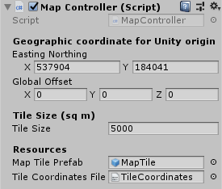

# OS Map Tiling System
Tiling System for Unity using OS Open Raster Tiles

## Contents
This Unity project includes the following components:
- A map tile prefab
- The script `MapController.cs` which instantiates map tiles in the corrrect position using OS National Grid coordinates and applies the correct OS open raster tile as a texture.
- A reference file `TileCoordinates.csv` which provides bottom left (south west) coordinate for each map tile.
- An FME workspace `MapTileBoundsExtractor.fmw` which can be used to read the coordinates from GeoTIFF files and export them to a CSV.

## Use

1. To use this package you will need to download your own copies of the [OS Open Map Local](https://www.ordnancesurvey.co.uk/business-government/products/open-map-local) raster tiles for the TQ grid square. This covers the majority of London and the region extending to the South coast of England. To test the package download that region first.
2. Downloaded tiles should be placed in the project folder `Assets/Resources/MapTiles`.
3. Open the 'MapTiler' scene in Unity and press play.
4. The MapController script will read the GeoTIFF tiles placed in the Recources folder and instantiate textured maptile prefabs according to OSGB eastings and northings held in the 'TileCoordinates' reference file. The tiles are parented to a map container object and shifted to world origin (0,0,0) by applying an offset.

5. The user can specify a particular OSGB coordinate that will be used as the Unity world origin. This is currently set to the easting `X = 537904` and northing `Y = 184041` in the Unity inspector.
6. The user can also set the map tile size in metres.

This package can be used with Unity [Standard Assets](https://assetstore.unity.com/packages/essentials/asset-packs/standard-assets-32351) which will allow you to add a car or airplane to the scene.

## Adding coordinates for the rest of the UK
If you wish to include other areas of the UK you would need to update the coordinate file. This can be done with a GIS. Alternatively you can use the FME workspace `MapTileBoundsExtractor.fmw` included with this project. This will extract coordinates from downloaded OS map tiles in the GeoTIFF format. 

To use the workspace you can download the [FME Desktop](https://www.safe.com/) by Safe Software which is free to use for non-commercial purposes with a trial or personal licence. When using the workspace it will prompt you to select the files you want to process and the folder location for the new TileCoordniates file to be output.

## Acknowledgements
This project is linked to research at CASA funded by the [Engineering and Physical Science Research Council (EPSRC)](https://epsrc.ukri.org/) and [Ordnance Survey (OS)](https://www.ordnancesurvey.co.uk/), the national mapping agency for Great Britain. 
